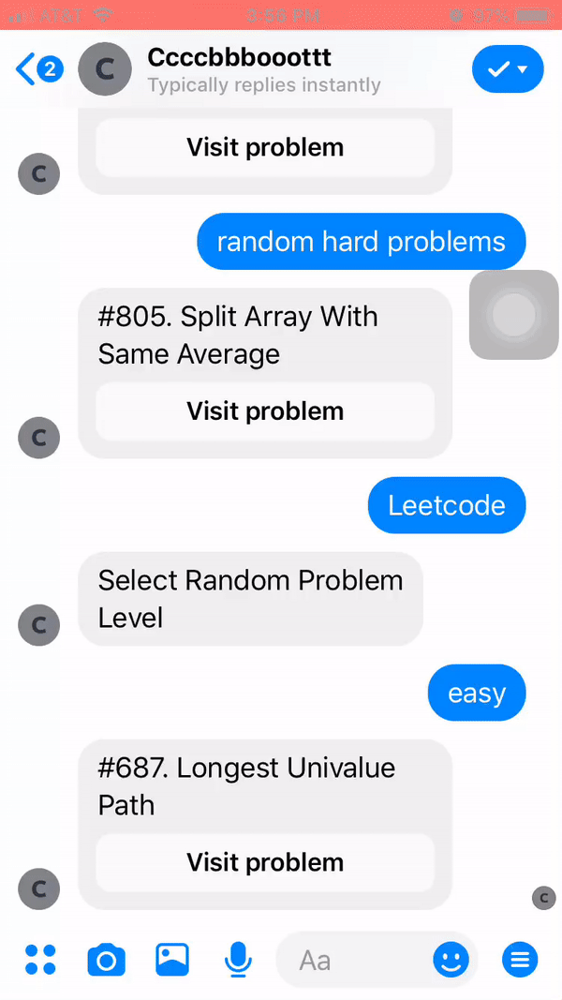

# FB Chatbot
Simple Facebook Messenger Chatbot.

## Getting Started

### Prerequisites
1. Follows instructions from [YouTube channel] (https://www.youtube.com/watch?v=bUwiKFTvmDQ)
2. Exports Access Token as Heroku environment variable. 
`heroku config:set ACCESS_TOKEN=<YOUR_ACCESS_TOKEN>`

### Built With
1. [Heroku](https://dashboard.heroku.com/apps)
2. [FB Messenger Platform](https://developers.facebook.com/docs/messenger-platform/)

## Funtionality
Leetcode chatbot use case:

